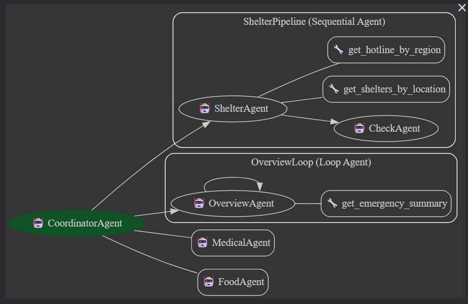

# TP-Projet-Multi-Agents-ADK

# 🇱🇧 Lebanon Displaced Persons Assistant

### Système multi-agents ADK — Aide aux personnes déplacées au Liban

> **Disclaimer** : Les données sont partiellement vérifiées. Toujours confirmer avant de se déplacer.

---

## 📖 Description du projet

Système d'aide humanitaire pour les personnes déplacées au Liban.  
Une personne déplacée pose une question en langage naturel et reçoit immédiatement :

- 🏠 Des **abris d'urgence** (écoles publiques réquisitionnées par le gouvernement)
- 🏥 Des **ressources médicales** (lignes nationales gratuites 24h/7)
- 🍞 De l'**aide alimentaire** (ONG et initiatives locales)
- 📞 Les **hotlines régionales** officielles par gouvernorat

Le système répond en **anglais, français ou arabe** selon la langue de l'utilisateur.
L’objectif est de démontrer comment une architecture multi-agents peut structurer l’accès à des informations humanitaires critiques.

---

## 🗂️ Base de données humanitaire

Dans le cadre de ce projet, une base de données humanitaire spécifique au Liban a été créée manuellement afin d'alimenter les outils utilisés par les agents.

```
my_agent/data/lebanon_resources.json
```

Cette base regroupe différentes catégories de ressources utiles pour les personnes déplacées :

- 🏠 abris d'urgence (écoles publiques réquisitionnées comme refuges)
- 🍞 aide alimentaire (ONG et initiatives locales)
- 🏥 ressources médicales (lignes nationales d'urgence)
- 📞 hotlines régionales officielles
- 🔎 règles de vérification des ressources

---

## 📊 Sources des données

Les informations ont été collectées et consolidées à partir de plusieurs types de sources publiques :

### Sources officielles

- Plateformes gouvernementales de gestion des crises
- Communiqués d'organisations humanitaires
- Annonces d'écoles utilisées comme abris temporaires

### Organisations et ONG

- initiatives locales de distribution alimentaire
- organisations humanitaires actives sur le terrain

### Sources communautaires

- publications sur les réseaux sociaux
- groupes locaux d'entraide
- partages d'informations communautaires

Ces différentes sources ont été croisées lorsque possible afin d'améliorer la fiabilité des informations.

---

## ⚠️ Limites et vérification des données

Malgré ces efforts de collecte, certaines informations peuvent :

- être partielles
- évoluer rapidement
- ne plus être disponibles

Pour cette raison, le système inclut systématiquement un message recommandant de **contacter les ressources avant de se déplacer**.

---

## 🔄 Perspectives d'amélioration

Dans une version plus avancée du système, cette base de données pourrait être améliorée en :

- intégrant des API d'organisations humanitaires
- utilisant une base de données dynamique (PostgreSQL / MongoDB)
- mettant en place un processus de validation des ressources
- permettant des mises à jour en temps réel

---

## 🏗️ Architecture multi-agents

Le système est construit avec **Google ADK** et utilise plusieurs types d’agents.



Le système repose sur un **agent coordinateur** qui analyse la requête utilisateur et délègue la tâche au bon agent ou workflow.

Cette architecture permet :

- une séparation claire des responsabilités
- une meilleure maintenabilité
- une plus grande robustesse du système

### Agents et leurs rôles

| Agent               | Type            | Rôle                                                                                     |
| ------------------- | --------------- | ---------------------------------------------------------------------------------------- |
| `Coordinator Agent` | LlmAgent (root) | Route les requêtes via `transfer_to_agent` et `AgentTool`                                |
| `Shelter Agent`     | LlmAgent        | Trouve les abris et hotlines régionales                                                  |
| `Check Agent`       | LlmAgent        | Vérifie que la réponse contient les informations essentielles (contacts, avertissements) |
| `Medical Agent`     | LlmAgent        | Fournit les contacts médicaux d'urgence                                                  |
| `Food Agent`        | LlmAgent        | Recherche les initiatives d'aide alimentaire                                             |
| `Overview Agent`    | LlmAgent        | Génère une vue globale des ressources disponibles                                        |

---

## ✅ Contraintes techniques remplies

| #   | Contrainte              | Implémentation                                                                                                                       |
| --- | ----------------------- | ------------------------------------------------------------------------------------------------------------------------------------ |
| 1   | ≥ 3 LlmAgents           | 5 agents : CoordinatorAgent, ShelterAgent, VerifyAgent, MedicalAgent, FoodAgent                                                      |
| 2   | ≥ 3 tools custom        | 5 outils : `get_shelters_by_location`, `get_medical_resources`, `get_food_and_aid`, `get_hotline_by_region`, `get_emergency_summary` |
| 3   | ≥ 2 Workflow Agents     | `ShelterPipeline` (SequentialAgent) + `OverviewLoop` (LoopAgent)                                                                     |
| 4   | State partagé           | `output_key` sur chaque agent spécialisé spécialisé                                                                                  |
| 5   | 2 mécanismes délégation | `transfer_to_agent` (CoordinatorAgent -> Pipelines) + `AgentTool` (CoordinatorAgent -> MedicalAgent/FoodAgent)                       |
| 6   | ≥ 2 callbacks           | 4 types : `before_agent`, `after_agent`, `before_tool`                                                                               |
| 7   | Runner programmatique   | `main.py` avec `Runner` + `InMemorySessionService`                                                                                   |
| 8   | Démo fonctionnelle      | `adk web` et `python main.py` fonctionnels                                                                                           |

---

## 🚀 Installation et lancement

```bash
# 1. Cloner et créer l'environnement
git clone <repo>
cd tp-adk
python -m venv .venv
source .venv/bin/activate  # Mac/Linux
.venv\Scripts\activate.bat  # Windows

# 2. Installer les dépendances
pip install -r requirements.txt

# 3. Configurer la clé API Gemini
creer un fichier .env
GOOGLE_API_KEY=YOUR_API_KEY

# 4. Lancer
adk web
# ou
python main.py
```

---

## 💬 Exemples de requêtes

```
"I am in Saida with my family and we had to leave our home. Where can we find shelter?"
"My father is injured in Bekaa. Where can we get medical help urgently?"
"Where can I sleep tonight in Beirut? I am alone."
"Je suis à Tripoli avec mes enfants. Nous avons besoin d'un abri."
"I feel very distressed after fleeing my home. Is there psychological support?"
```

Autres scenarios de test se trouvent dans le fichier **test_scenarios.json**

## ⚠️ Problèmes rencontrés et solutions

### 1. Conflit de parent agent (`Agent already has a parent`)

**Problème :** ADK impose qu'un agent ne peut avoir qu'un seul parent. En réutilisant `location_agent` à la fois dans `AnalysisPipeline` (SequentialAgent) et dans `CoordinatorAgent` (sub_agents), ADK lançait une `ValidationError`.

**Solution :** Créer des instances séparées pour chaque contexte. Deux agents avec les mêmes paramètres mais des noms distincts (`LocationAgent` vs `LocationAgentDirect`). Finalement, l'architecture a été simplifiée pour éviter cette duplication.

---

### 2. Variables de state non trouvées (`Context variable not found`)

**Problème :** Les instructions des agents utilisaient des templates `{user_location}`, `{user_needs}` etc. ADK tente de résoudre ces variables au moment de l'appel. Si elles n'existent pas encore dans le state (personne ne les a définies), ADK lève une `KeyError`.

**Solution :** Supprimer tous les `{variables}` des instructions. Les agents extraient directement la localisation depuis le message de l'utilisateur, sans passer par le state partagé pour les données d'entrée. Le state reste utilisé uniquement pour les `output_key` (données de sortie).

**N.B.** : Problème rencontré dans une version initiale de l'architecture.

---

### 3. Boucles infinies sur les appels d'outils

**Problème (majeur) :** Les modèles locaux (Gemma 2 2B, Llama 3.2 3B) rappelaient le même outil en boucle infinie, ignorant les résultats déjà obtenus. Exemple : `get_medical_resources` appelé 10+ fois de suite.

**Causes identifiées :**

- Gemma 2 2B : trop petit, ne supporte pas le function calling fiable
- Llama 3.2 3B : meilleur mais varie les arguments (`need="mental health"` puis `need="psychological support"`), ce qui contournait la détection de boucle basée sur les arguments
- L'outil retournait `"No shelter found"` pour les régions sans données -> le modèle réessayait

**Solutions tentées :**

1. Instructions ultra-courtes avec `DO NOT call more than once` -> insuffisant
2. `after_tool_callback` (`prevent_tool_loop`) bloquant basé sur `tool.name` -> bloquait mais le LLM continuait à demander
3. `max_llm_calls` -> n'existe pas dans cette version d'ADK

**Solution finale retenue :** Utilisation de **Gemini 2.5 Pro**, beaucoup plus fiable pour les architectures multi-agents.

---

## 📁 Structure du projet

```
tp-adk/
├── .env
├── .gitignore
├── requirements.txt
├── main.py
│
└── my_agent/
    ├── __init__.py
    ├── agent.py
    ├── callbacks.py
    │
    ├── data/
    │   └── lebanon_resources.json
    │
    └── tools/
        ├── __init__.py
        └── resources_tools.py
│
└── tests/
    └── test_scenarios.json

---

```

## 📌 Conclusion

Ce projet démontre comment une architecture multi-agents peut organiser l’accès à des ressources humanitaires critiques.

En séparant :

- la coordination
- la récupération des données
- la validation des réponses

le système reste modulaire, extensible et plus fiable.

---
